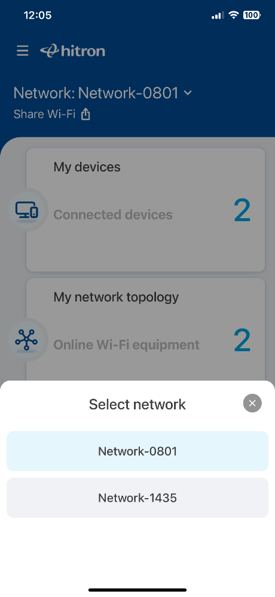
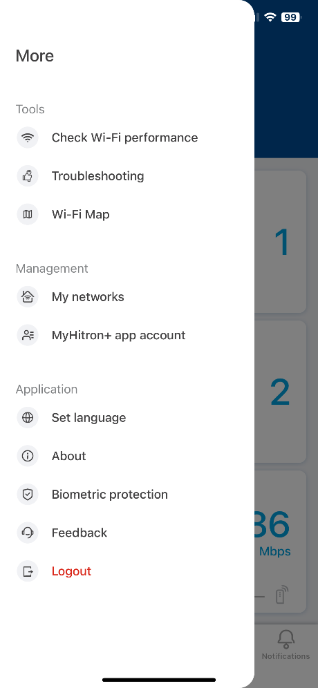
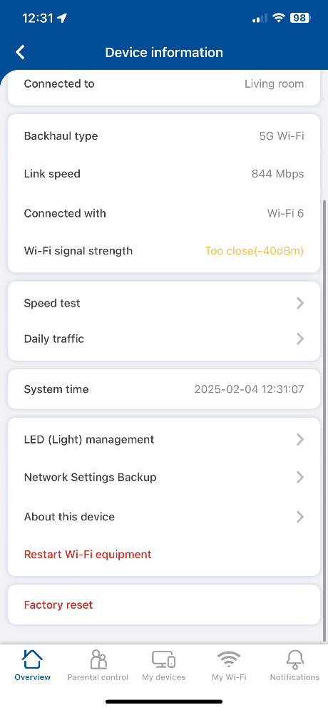
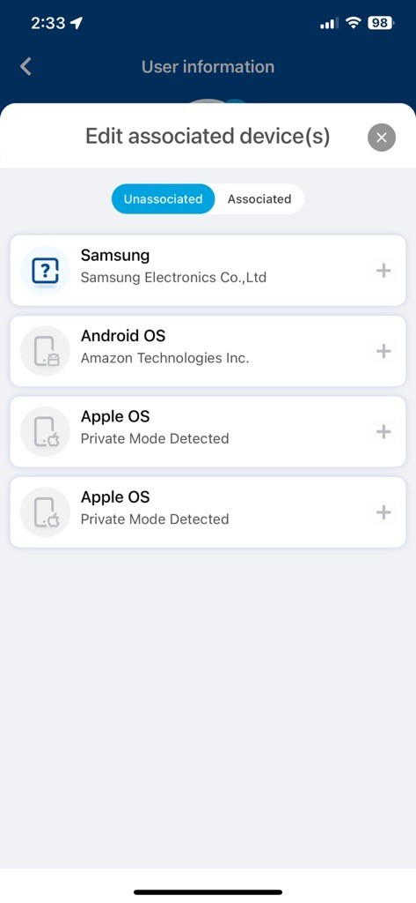

<Frame>

</Frame>

<Warning>
**Date: 2025-08-01**
</Warning>

---

# Revision History

| **Revision** | **Date**     | **Author**      | **Modifications** |
|:------------:|:------------:|:---------------|:------------------|
| 1            | 2025-02-20   | Khalid Hamour   | version 2.5.6     |
| 2            | 2025-02-28   | Daphne          | version 2.5.7     |
| 3            | 2025-03-14   | Daphne          | version 2.5.8     |
| 4            | 2025-04-11   | Daphne          | version 2.5.9     |
| 5            | 2025-05-16   | Daphne          | version 2.5.10    |
| 6            | 2025-06-23   | Daphne          | version 2.5.11    |
| 7            | 2025-08-01   | Daphne          | version 2.5.12    |

---

# Notice

This document contains information, which is the proprietary property of Hitron Technologies, Inc. This document is received in confidence and its contents cannot be disclosed or copied without the prior written consent of Hitron Technologies, Inc.

Nothing in this document constitutes a guaranty, warranty, or license, express or implied. Hitron Technologies, Inc. disclaims all liability for all such guaranties, warranties, and licenses, including but not limited to: fitness for a particular purpose; merchantability; non-infringement of intellectual property or other rights of any third party or of Hitron Technologies, Inc.; indemnity; and all others.

**Copyright**  
Copyright ©Hitron Technologies, Inc. 2025. All rights reserved.

**Trademarks**  
This document may contain registered trademarks of Hitron Technologies, Inc.

---

# User Account

## Create a Hitron Account

To use the MyHitron+ app, you'll first need to create an account.

Click "Create Account" on the app's initial screen if you do not have one yet.

<Steps>
<Step title="Enter Email">
  Enter your desired email address.
</Step>
<Step title="Create Password">
  Create a strong password.
</Step>
<Step title="Confirm Password">
  Confirm the password by re-typing it.
</Step>
<Step title="Agree to Terms">
  Follow any additional on-screen prompts, which may include agreeing to terms and conditions.
</Step>
<Step title="Verify Email">
  Tap the "Send verification mail" to complete the registration.
</Step>
</Steps>

<Frame>

</Frame>

<Frame>

</Frame>

## Forgotten Password

If you've forgotten your MyHitron+ account password, you can easily reset it.

<Steps>
<Step title="Access Forgot Password">
  On the login screen, click on the "Forgot password?" link.
</Step>
<Step title="Enter Email">
  Enter the email address associated with your MyHitron+ account.
</Step>
<Step title="Send Instructions">
  Press the send instructions button at the bottom of the screen.
</Step>
<Step title="Check Email">
  Check your email inbox for a message from MyHitron+. Click on the password reset link provided in the email and follow the steps indicated within.
</Step>
<Step title="Create New Password">
  You will be directed to a page to create a new password. Enter your new password and confirm it in the respective fields.
</Step>
</Steps>

<Frame>

</Frame>

<Frame>

</Frame>

<Frame>

</Frame>

<Frame>

</Frame>

<Frame>

</Frame>

<Frame>

</Frame>

## Biometric Protection

For enhanced security and convenience, you can enable biometric protection if your device supports it (e.g., fingerprint or face recognition).

After logging in or during the initial setup, you may be prompted to enable biometric protection. Follow the on-screen instructions to set it up using your device's fingerprint scanner or face recognition. This allows for quicker access to the app.

<Frame>

</Frame>

## Delete Account

If you wish to delete your MyHitron+ account, follow these steps. Please note that this action will remove your data associated with the app.

<Steps>
<Step title="Access Account Settings">
  Access the side menu (tapping a menu icon like ☰) and press the "MyHitron+ app account" button.
</Step>
<Step title="Delete Account">
  On the account screen, press the "Delete this Myhitron+ account" button.
</Step>
<Step title="Confirm Deletion">
  To confirm, you will be asked to type the phrase "Delete account" into a text field as shown on the screen. This is a safety measure to prevent accidental deletion. After typing the confirmation phrase, press the final delete account button.
</Step>
</Steps>

<Frame>

</Frame>

<Frame>

</Frame>

<Frame>

</Frame>

---

# Network Controls

## Add a New Network

This section guides you on how to add and set up a new Hitron network (e.g., a new router or extender) using the MyHitron+ app.

<Steps>
<Step title="Access More Options">
  On the app's overview page, click the "More" option or a similar menu button to access further settings.
</Step>
<Step title="Select My Networks">
  From the menu that appears, click "My Networks".
</Step>
<Step title="Add New Network">
  On the "My Networks" screen, click the "+" (plus) icon, located in the top right corner, to add a new network or device.
</Step>
</Steps>

<Frame>

</Frame>

<Frame>

</Frame>

<Frame>

</Frame>

### New Install

Follow these steps if you are setting up a new Hitron device for the first time.

<Steps>
<Step title="Pair Device">
  The app will likely prompt you to scan a QR code found on a label on your Hitron device. Use your phone's camera through the app to scan this QR code.
</Step>
<Step title="Handle Unknown Device">
  If the device is not automatically detected after scanning, or if you encounter an "Unknown device", the app may provide options to try scanning again, or to manually enter device information.
</Step>
<Step title="Set Up Wi-Fi">
  Once the device is paired, you will be guided to configure your Wi-Fi network. Enter your desired Wi-Fi Network Name (SSID), create a secure Password for your Wi-Fi network, and confirm the details to complete the Wi-Fi setup.
</Step>
</Steps>

<Frame>

</Frame>

<Frame>

</Frame>

<Frame>

</Frame>

<Frame>

</Frame>

<Frame>

</Frame>

<Frame>

</Frame>

<Frame>

</Frame>

<Frame>

</Frame>

<Frame>

</Frame>

### Already Configured

If your Hitron device is already set up but you want to manage it with the app:

<Steps>
<Step title="Connect to Wi-Fi">
  Ensure your smartphone is connected to the Wi-Fi network broadcast by your Hitron device.
</Step>
<Step title="Detect Equipment">
  The app should detect the Wi-Fi equipment in your network. Confirm this detection.
</Step>
<Step title="Enter Password">
  Enter your device's Administrator password. This is typically found on a label on the device itself, unless you have previously changed it.
</Step>
<Step title="Configure Settings">
  Set up or confirm your Wi-Fi settings. After entering the administrator password, you can view, configure, or confirm your Wi-Fi settings.
</Step>
</Steps>

<Frame>

</Frame>

<Frame>

</Frame>

<Frame>

</Frame>

<Frame>

</Frame>

<Frame>

</Frame>

<Frame>

</Frame>

## Change SSID and Password

You can change your Wi-Fi network name (SSID) and password at any time.

<Steps>
<Step title="Navigate to My Wi-Fi">
  Navigate to the "My Wi-Fi" tab, located at the bottom of the app screen.
</Step>
<Step title="Select Network">
  Select the network (e.g., Primary 2.4GHz, Primary 5GHz, or Guest Network) you want to modify from the list.
</Step>
<Step title="Edit Network">
  Press the edit button (often a pencil icon) associated with the selected network's details.
</Step>
<Step title="Save Changes">
  Edit your Wi-Fi Network Name (SSID) and/or Password in the provided fields. Press 'Save' to confirm changes.
</Step>
</Steps>

<Frame>

</Frame>

<Frame>

</Frame>

<Frame>

</Frame>

<Frame>

</Frame>

## Enabling Guest Wi-Fi

A guest Wi-Fi network provides internet access to visitors without giving them access to your primary network and connected devices.

<Steps>
<Step title="Access My Wi-Fi">
  Press the "My Wi-Fi" tab at the bottom of the screen.
</Step>
<Step title="Select Guest Network">
  Select the "Guest Network" option from the list of networks.
</Step>
<Step title="Enable Guest Wi-Fi">
  Toggle the "Enable Guest Wi-Fi" switch to the 'on' position. You can also configure the Guest Network's SSID and password here.
</Step>
<Step title="Confirm Restart">
  Press Yes to confirm the restart of your device.
</Step>
</Steps>

<Frame>

</Frame>

<Frame>

</Frame>

<Frame>

</Frame>

<Frame>

</Frame>

<Warning>
Note: A Device restart is necessary to enable or make changes to the guest Wi-Fi network.
</Warning>

## Managing Multiple Networks

If your MyHitron+ app is managing multiple Hitron networks (e.g., home and office, or multiple properties):

<Steps>
<Step title="Select Network">
  Select the drop-down arrow next to the currently displayed network name, at the top of the main app screen.
</Step>
<Step title="Switch Network">
  From the list that appears, select the network you would like to manage.
</Step>
</Steps>

<Frame>

</Frame>

<Frame>

</Frame>

## Network Information

To view detailed information about your Hitron devices:

<Steps>
<Step title="Access My Networks">
  Access the side menu and select the "My Networks" option.
</Step>
<Step title="Select Device">
  From the list of your Hitron equipment (router, extenders), select the specific device whose information you wish to access.
</Step>
<Step title="View Device Info">
  Press the "About this device" option. This will display detailed information such as model number, MAC address, IP address, firmware version, serial number, etc.
</Step>
</Steps>

<Frame>

</Frame>

<Frame>

</Frame>

<Frame>

</Frame>

---

# Devices

## Add an Extender

### Bluetooth

Adding an extender can help improve Wi-Fi coverage in your home. This section describes adding an extender using a Bluetooth connection for setup.

<Steps>
<Step title="Open Network Topology">
  Open the network topology view by pressing the "My network topology" card on the app's main or overview screen.
</Step>
<Step title="Add Extender">
  In the network topology view, select the "+ Extender" button, usually located at the bottom right of the screen.
</Step>
<Step title="Search for Extender">
  The app will search for nearby extenders via Bluetooth. Select the extender you want to add from the list of detected devices.
</Step>
<Step title="Complete Installation">
  Press "Next". The app will then guide you through the installation process. Wait for the installation to complete. You may be asked to place the extender in an optimal location for the best signal.
</Step>
</Steps>

<Frame>

</Frame>

<Frame>

</Frame>

<Frame>

</Frame>

<Frame>

</Frame>

<Frame>

</Frame>

<Frame>

</Frame>

<Frame>

</Frame>

<Frame>

</Frame>

<Frame>

</Frame>

### Factory Reset Device

<Steps>
<Step title="Access My Networks">
  Select the "my networks" option from the menu.
</Step>
<Step title="Select Device">
  Select the device (router or extender) from the list that you want to factory reset.
</Step>
<Step title="Factory Reset">
  In the device's settings or details page, press the "Factory reset" option.
</Step>
<Step title="Confirm Reset">
  To confirm your choice, enter the on-screen prompt (e.g., type "RESET") into the text field and then press the "Factory reset" button at the bottom of the screen.
</Step>
</Steps>

<Frame>

</Frame>

<Frame>

</Frame>

<Frame>

</Frame>

<Frame>

</Frame>

<Frame>

</Frame>

## Restart Device

Restarting your Wi-Fi equipment can often resolve minor connectivity issues.

<Steps>
<Step title="Access My Networks">
  Select the "My Networks" option from the side menu.
</Step>
<Step title="Select Device">
  Select the specific device (router or extender) you wish to restart from the list.
</Step>
<Step title="Restart Device">
  Press the "Restart Wi-Fi equipment" option on the device's detail page.
</Step>
<Step title="Confirm Restart">
  Press the "Restart" button on the confirmation prompt to begin the device restart. The device will take a few minutes to reboot.
</Step>
</Steps>

<Frame>

</Frame>

<Frame>

</Frame>

<Frame>

</Frame>

<Frame>

</Frame>

## Backup Device Settings

You can back up your Hitron device's current configuration settings. This is useful if you need to restore them later, for example, after a factory reset.

<Steps>
<Step title="Access My Networks">
  Select the "My Networks" option from the side menu.
</Step>
<Step title="Select Device">
  Select the device whose settings you wish to backup.
</Step>
<Step title="Backup Settings">
  Press the "networks settings backup" option.
</Step>
<Step title="Create Backup">
  On the backup screen (which might default to a "Backup" tab), press the "Backup my settings" button at the bottom of the screen.
</Step>
<Step title="Name Backup">
  Enter a name for the backup file for easier identification later (e.g.,"HomeConfig_May2025"). Press Save or Confirm.
</Step>
</Steps>

<Frame>

</Frame>

<Frame>

</Frame>

<Frame>

</Frame>

<Frame>

</Frame>

<Frame>

</Frame>

## Restore Device Backup

If you have previously backed up your device settings, you can restore them.

<Steps>
<Step title="Access My Networks">
  Select the "My Networks" option from the side menu.
</Step>
<Step title="Select Device">
  Select the device you would like to restore the backup to.
</Step>
<Step title="Access Backup">
  Select the "Network settings backup" option.
</Step>
<Step title="Switch to Restore">
  Switch to the "Restore" tab, usually located at the top of the screen, alongside the "Backup" tab.
</Step>
<Step title="Select Backup">
  Choose the backup file you want to restore from the list of available backups.
</Step>
<Step title="Restore Settings">
  Press the "Restore" button to apply the selected backup to your device. Confirm your choice. The device will likely restart and apply the backed-up settings.
</Step>
</Steps>

<Frame>

</Frame>

<Frame>

</Frame>

<Frame>

</Frame>

<Frame>

</Frame>

<Frame>

</Frame>

<Frame>

</Frame>

---

# Parental Controls

Parental controls allow you to manage internet access for specific users or devices.

## Create a User Profile

Creating user profiles helps you apply specific rules to different members of your household.

<Steps>
<Step title="Access Parental Controls">
  Switch to the "Parental Control" tab, typically found at the bottom of the app screen.
</Step>
<Step title="Add Profile">
  If no profiles exist, press the "Add one now" button in the center of the screen. Alternatively, press the "+" (plus) icon, often in the top right corner, to add a new profile.
</Step>
<Step title="Enter Name">
  Enter a name for the person you want to create a profile for (e.g., "Child's Name," "Teenager").
</Step>
<Step title="Save Profile">
  Press the "Save" button to create the profile.
</Step>
</Steps>

<Frame>

</Frame>

<Frame>

</Frame>

<Frame>

</Frame>

<Frame>

</Frame>

## Add a Device to the Profile

Associate specific devices (like a child's tablet or phone) with a user profile to apply parental control rules to those devices.

<Steps>
<Step title="Access Parental Controls">
  Switch to the "parental control" tab from the bottom of the screen.
</Step>
<Step title="Select Profile">
  Select the user profile to which you want to add a device.
</Step>
<Step title="Edit Devices">
  Within the selected profile's details, click on the edit button (a pencil icon) inside the "Associated device(s)" card.
</Step>
<Step title="Add Device">
  A list of devices connected to your network will appear. Press the "+" (plus) button next to the device(s) you want to associate with this profile.
</Step>
</Steps>

<Frame>

</Frame>

<Frame>

</Frame>

<Frame>

</Frame>

<Frame>

</Frame>

## Pause Internet

You can temporarily pause internet access for specific devices or entire user profiles.

### Pause Internet Access by Device

<Steps>
<Step title="Access My Devices">
  Switch to the "My devices" tab at the bottom of the screen. This tab lists all devices currently connected to your network.
</Step>
<Step title="Pause Device">
  Press the pause button (a pause symbol ⏸) next to the device for which you want to suspend internet access.
</Step>
</Steps>

<Frame>

</Frame>

<Frame>

</Frame>

<Note>
The pause button will typically only be active for devices currently connected to the network.
</Note>

### Pause Internet Access by Profile

<Steps>
<Step title="Access Parental Controls">
  Switch to the "Parental Controls" tab at the bottom of the screen.
</Step>
<Step title="Pause Profile">
  Press the pause button next to the user profile for which you want to suspend internet access. This will pause internet for all devices associated with that profile.
</Step>
</Steps>

<Frame>

</Frame>

<Frame>

</Frame>

### Pause Schedule

Set a recurring schedule to automatically pause internet access for a user profile at specific times (e.g., during homework hours or bedtime).

<Steps>
<Step title="Edit Profile">
  Navigate to the user profile for whom you want to set a schedule. Click "Edit" or look for a schedule option within their profile information.
</Step>
<Step title="Set Schedule">
  Set the desired pause schedule. This typically involves selecting days of the week and start/end times for the internet pause. Save the schedule.
</Step>
</Steps>

<Frame>

</Frame>

<Frame>

</Frame>

---

# App Features

## Share Wi-Fi Credentials

Easily share your Wi-Fi network name and password with guests.

<Steps>
<Step title="Access Share Wi-Fi">
  On the app's main overview screen, press the "Share Wi-Fi" button, located at the top.
</Step>
<Step title="Select Method">
  Select the sharing method you want to use. Common options are QR code, Instant Messaging, or WPS.
</Step>
</Steps>

<Frame>

</Frame>

<Frame>

</Frame>

### QR Code

<Steps>
<Step title="Select Network">
  Using the drop-down menu, select the network (e.g., Primary Wi-Fi or Guest Wi-Fi) whose credentials you wish to share.
</Step>
<Step title="Show QR Code">
  A QR code will be displayed. Have the other person scan this QR code with their device's camera or a QR code scanner app to automatically connect to the selected Wi-Fi network.
</Step>
</Steps>

<Frame>

</Frame>

<Frame>

</Frame>

### Instant Messaging

<Steps>
<Step title="Select Network">
  Press the button corresponding to the network (e.g., "Share Primary Wi-Fi" or "Share Guest Wi-Fi") whose credentials you wish to share.
</Step>
<Step title="Choose App">
  Your device's native share options will appear. Select your preferred instant messaging app (e.g., WhatsApp, SMS, Email) to send the network name and password.
</Step>
</Steps>

<Frame>

</Frame>

<Frame>

</Frame>

<Frame>

</Frame>

<Frame>

</Frame>

### WPS

**Note: If you cannot press the button, please ensure that WPS is enabled in the settings under the "My Wi-Fi" tab for the relevant network.**

<Steps>
<Step title="Start Pairing">
  Press the "Start Pairing" button on the screen in the MyHitron+ app.
</Step>
</Steps>

<Frame>

</Frame>

## Wi-Fi Map

The Wi-Fi Map feature helps you visualize your home layout and test Wi-Fi strength in different zones.

### Floor Management

#### Add a Floor

<Steps>
<Step title="Add Floor">
  If this is your first time using the Wi-Fi map, press the "Add floor" button in the center of the screen. Otherwise, press the "+" (plus) button, on the top right of the screen, to add a new floor.
</Step>
<Step title="Name Floor">
  Type in a name for the new floor (e.g., "Upstairs," "Basement") in the text area or select a predefined name from the drop-down menu if available.
</Step>
<Step title="Create Floor">
  Press the "Next" button to create your new floor plan.
</Step>
</Steps>

<Frame>

</Frame>

<Frame>

</Frame>

<Frame>

</Frame>

<Frame>

</Frame>

#### Delete a Floor

<Steps>
<Step title="Select Floor">
  On the Wi-Fi Map screen, find the floor card you wish to delete. Press the three dots (ellipsis menu icon) on that floor card.
</Step>
<Step title="Delete Floor">
  From the menu that appears, press the "Delete floor" option.
</Step>
<Step title="Confirm Deletion">
  Press the "Delete" button on the confirmation prompt to permanently delete the floor and its associated zones.
</Step>
</Steps>

<Frame>

</Frame>

<Frame>

</Frame>

<Frame>

</Frame>

#### Rename a Floor

<Steps>
<Step title="Access Menu">
  Press the three dots (ellipsis menu icon) on the floor card that you wish to rename.
</Step>
<Step title="Edit Name">
  Press the "Edit floor name" option from the menu.
</Step>
<Step title="Enter New Name">
  Type in a new name for the floor or select one from the drop-down list.
</Step>
<Step title="Save Changes">
  Press the "Save" button to complete the operation.
</Step>
</Steps>

<Frame>

</Frame>

### Zone Management

Zones are specific areas within a floor (e.g., "Living Room," "Kitchen").

#### Add Zone

<Steps>
<Step title="Open Floor Plan">
  Open the floor plan to which you want to add a zone by selecting it from the Wi-Fi Map.
</Step>
<Step title="Select Area">
  Press a square (or tap an area) on the map grid where you want to add a new zone. This may bring up an "Add Zone" prompt.
</Step>
<Step title="Choose Icon">
  Select an icon that best represents the zone you are adding (e.g., a bed icon for a bedroom, a sofa for a living room).
</Step>
<Step title="Name Zone">
  Pick a name for the zone (e.g., "Bedroom") and confirm the icon to easily identify it on the grid.
</Step>
<Step title="Add Equipment">
  If you have a gateway (router) or an extender physically located in this zone, you can indicate it by pressing the respective "Gateway in this zone" or "Extender in this zone" buttons, usually at the bottom of the screen.
</Step>
<Step title="Save Zone">
  Press the "Save" button to add the new zone to the map.
</Step>
</Steps>

<Frame>

</Frame>

<Frame>

</Frame>

<Frame>

</Frame>

<Frame>

</Frame>

<Frame>

</Frame>

#### Edit Zone

<Steps>
<Step title="Select Zone">
  On the floor map, select the zone you want to edit by tapping on it.
</Step>
<Step title="Edit Zone">
  Press the "Edit" button (like pencil) on the zone information card that appears (at the bottom of your screen).
</Step>
<Step title="Make Changes">
  Make the desired adjustments to the zone's name, icon, or associated gateway/extender.
</Step>
<Step title="Save Changes">
  Press the "Save" button to apply your changes.
</Step>
</Steps>

<Frame>

</Frame>

<Frame>

</Frame>

<Frame>

</Frame>

#### Delete Zone

<Steps>
<Step title="Select Zone">
  Select the zone you want to delete from the floor map.
</Step>
<Step title="Delete Zone">
  Press the "Delete" button on the zone card at the bottom of the screen.
</Step>
<Step title="Confirm Deletion">
  Press the "Delete" button on the confirmation prompt to confirm the deletion.
</Step>
</Steps>

<Frame>

</Frame>

#### Test Speed in Zone

<Steps>
<Step title="Select Zone">
  Select the zone you want to test from the map.
</Step>
<Step title="Test Wi-Fi">
  Press the test Wi-Fi button on the zone card at the bottom of your screen.
</Step>
<Step title="Wait for Results">
  Wait for the test to be completed. Your phone needs to be physically in or near the zone for an accurate reading.
</Step>
</Steps>

<Frame>

</Frame>

<Frame>

</Frame>

<Note>
**Note:** The test should take about 5 seconds to complete.
</Note>

#### Check Zone Test History

<Steps>
<Step title="Select Zone">
  Select the zone for which you want to check the Wi-Fi speed test history.
</Step>
<Step title="View History">
  Press the "zone history" button on the zone card at the bottom of the screen.
</Step>
</Steps>

<Frame>

</Frame>

<Frame>

</Frame>

<Frame>

</Frame>

<Note>
This page will contain a history of past speed tests conducted in this zone. Past tests can be deleted by pressing the delete button (trash icon) on the side of each test entry.
</Note>

### Wi-Fi Performance

### Topology

To access the topology, press the "My network topology" card on the main screen.

<Frame>

</Frame>

<Frame>

</Frame>

<Note>
On this page you will see a visual representation of your network, including the main router, any extenders, and all devices currently connected to the network. This can help you understand your network structure and device connection.
</Note>

---

# Other

## Enable Biometric Lock

Secure your app access with your device's biometric features.

<Steps>
<Step title="Access Settings">
  Access the side menu and select the "Biometric protection" button.
</Step>
<Step title="Enable Biometric">
  Enable the biometric protection option by tapping the toggle switch. You may need to confirm with your device's biometric authentication (e.g., fingerprint scan or face ID) to activate it.
</Step>
</Steps>

<Frame>

</Frame>

<Frame>

</Frame>

## Change Language

Change the display language of the MyHitron+ app.

<Steps>
<Step title="Access Language Settings">
  Press the "Set language" button from the side menu.
</Step>
<Step title="Select Language">
  Choose the language you wish to use from the list provided (e.g., English, Français). The app will update its display language accordingly.
</Step>
</Steps>

<Frame>

</Frame>

<Frame>

</Frame>

---

<Info>
For more information and support, visit <a href="https://www.hitrontech.com/" target="_blank">Hitron Technologies</a>.
</Info>
